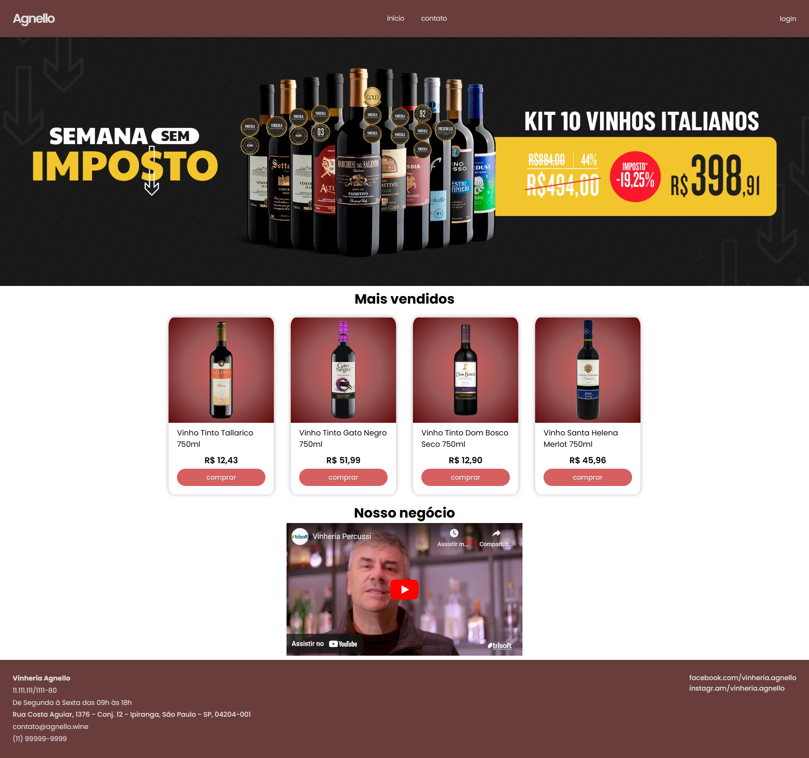
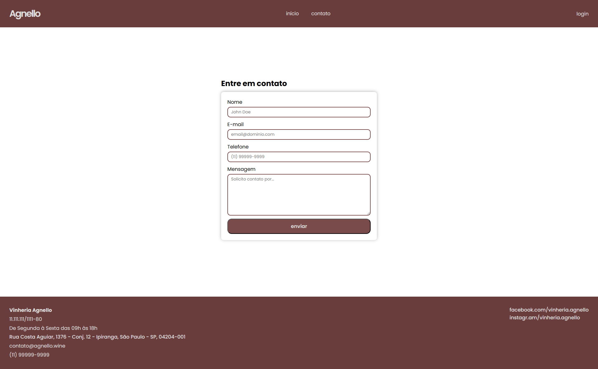

# Vinheria Agnello
A Vinheria Agnello é uma vinheria brasileira que começou suas operações em São Paulo há mais de 15 anos. Com apenas uma loja física, a empresa é reconhecida por sua ampla variedade de rótulos de vinícolas nacionais e internacionais. Um dos principais diferenciais da Vinheria Agnello é o treinamento de seus vendedores, que orientam os clientes sobre as características de cada variedade de uva, região, vinícola ou rótulo de vinho. Eles também sugerem combinações com diversos tipos de alimentos e refeições, adaptando os vinhos às diferentes ocasiões de consumo.

# Projeto
Desenvolver um e-commerce para que a Vinheria possa alavancar suas vendas visto que, na pandemia, com a impossibilidade de ida ao comércio, houve uma grande queda na receita da Vinheria Agnello.

# Tecnologias
- HTML
- CSS
- Javascript

# Motivação
Se trata do checkpoint/avaliação para a matéria de Web Development, ministrada pelo professor Caio Oliveira.

# Membros
- Marcos Ferreira (RM 556228)
- Alex Ribeiro (RM 556228)

# Imagens do Projeto
O projeto também pode ser acessado [clicando aqui](https://rfxct.github.io/checkpoint-2-web-development/)

### Página Inicial

### Loja

### Contato
